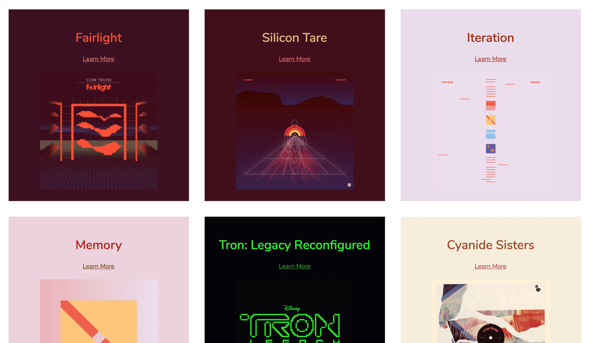

<h1 align="center">image-palette</h1>

<h4 align="center">
  Dynamically generate accessible color palettes from images
</h4>

Implement adaptive UIs dynamically from any image in right in the browser. Every
palette is parsed from the most dominant and vibrant colors in the source image,
and guaranteed to meet the
[WCAG contrast standard](https://www.w3.org/TR/UNDERSTANDING-WCAG20/visual-audio-contrast-contrast.html)
for accessible color pairings.

### Packages

This repository is setup as a monorepo with the following packages:

* [`image-palette-core`](https://github.com/FormidableLabs/image-palette/tree/master/packages/image-palette-core) - core logic for parsing palettes from images
* [`react-image-palette`](https://github.com/FormidableLabs/image-palette/tree/master/packages/react-image-palette) - A React adapter for `image-palette-core`
* [`preact-image-palette`](https://github.com/FormidableLabs/image-palette/tree/master/packages/preact-image-palette) - A Preact adapter for `image-palette-core`

## Maintenance Status

**Archived:** This project is no longer maintained by Formidable. We are no longer responding to issues or pull requests unless they relate to security concerns. We encourage interested developers to fork this project and make it their own!
